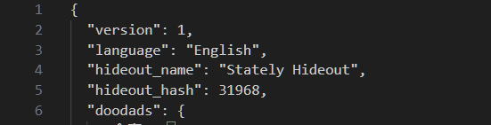

# POE Hideout Migration
 Guide on how to move designs (images) from one hideout type to another

Credits to https://gist.github.com/CristenPerret/ea3da944c2e976408662b988ee07d9e6 for base code

1. Find a hideout design you want on https://hideoutshowcase.com/
2. Download the hideout file (We will call this Hideout1.hideout)

3. Log into POE, to go your hideout and change it to the hideout type you want (For example: Stately Hideout)
4. After setting your hideout to the type you want, export it using the in game (We will call this Hideout2.hideout)
5. Locate and open the .hideout file (Hideout2.hideout, the one you just exported)
6. Copy the text from Line 2 to Line 5 over, and paste that into the Hideout file you downloaded from https://hideoutshowcase.com/ (paste content from Hideout2.hideout to Hideout1.hideout where Hideout1 is the one downloaded from https://hideoutshowcase.com/)

7. Now import that hideout file into the game
8. Walk around your hideout to see where the image (design) has been placed. You will most likely see it clipping within the terrain (in your chat it will tell you if there are any errors "X doodads loaded", this can give you an idea of whether the image was loaded in or not)
9. Now we will use move.py to change all the coordinates of the things used in the hideout design, to shift the image (design) to the right spot
10. Make sure you have hideout1.hideout file in the same folder as move.py
11. Open move.py in a text editor and change the following values:  
`
    #Edit values here  
    fileName = 'HIDEOUT FILE NAME HERE (hideout1.hideout)'
    xRelative = 0
    yRelative = 0
    fileName_output = 'OUTPUT FILE NAME HERE (FilenameOutput.hideout)'
`
12. Edit the xRelative and yRelative Variables to shift the image around. When I was importing to the Stately Hideout (from Backstreet) I tested only changing X, to see which direction the image moved. And then only changing Y, to see which direction the image moved. And then I changed both X and Y to get the image to the right spot. (Which ended up being xRelative = -95, yRelative = -90). Generally around 100 units is a vertical screen length so if you wanted to move the image approximately 1 screen down you would write xRelative = -100 and yRelative = -100.  

13. If it ever says in you chat that "X Doodas could not be loaded" that generally means that some of the materials used in the design are clipping into terrain and could not be placed. You will have to go back to step 9 and change the xRelative and yRelative values to move the image around until it is not clipping into terrain (or until its in a suitable position for your liking)

And it also doesnt matter if you have different languages in your hideout file, it will importable into the game regardless of language. (the errors=ignore tag in the open() function in move.py is used to ignore characters that cannot be decoded correctly)

# TDLR
1. Download hideout design you want, edit lines 2 - 5 with the values for the hideout that you want to use (to get the hash value and hideout name just set your hideout to the type you want, export it then copy those values over from there)  
2. Import the hideout file into your game, see where the design is located. Edit move.py so the "fileName" variable is pointing to the correct hideout file and change xRelative or yRelative to move that design around until you have it in the location you want.  

